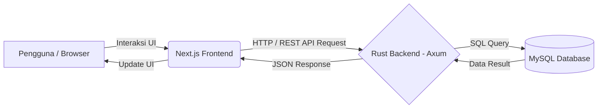

# Dokumen PRD & Arsitektur Sistem (Versi Baru)
**Nama Project:** Project FO KIMA
**Versi:** 2.0 (Migrasi)
**Tanggal:** 8 Juli 2026

---

## Status Progres per 9 Juli 2026

Yang sudah selesai:

- keputusan tahap awal dikunci ke `2 tabel utama`: `pelanggan` dan tabel internal `lokasi` untuk sheet `Kontrak Lengkap`
- format `kode_kontrak` dikunci ke `CTR-YYYY-XXXX`
- draft skema MySQL tahap 1 selesai
- kontrak API tahap 1 selesai
- migration awal dibuat di `backend/migrations/0001_init.sql`
- scaffold backend Rust awal sudah dibuat di folder `backend/`
- CRUD backend `pelanggan` sudah terimplementasi dan lolos uji manual dasar
- CRUD backend `Kontrak Lengkap` sudah terimplementasi dan lolos uji manual dasar
- logic bisnis `perpanjang` dan `upgrade` sudah terimplementasi
- sinkronisasi backend Rust ke tab Google Sheets `Pelanggan` sudah terpasang untuk create/update/delete pelanggan
- upload/hapus berkas pelanggan ke Google Drive sudah dipindahkan ke backend Rust
- frontend `Next.js` untuk modul tulis `Kontrak Lengkap` sudah terhubung ke backend Rust
- sinkronisasi backend Rust ke tab Google Sheets `Kontrak Lengkap` sudah terpasang untuk create/update/delete/perpanjang/upgrade kontrak
- upload/hapus berkas `Kontrak Lengkap` ke Google Drive sudah dipindahkan ke backend Rust
- verifikasi `cargo fmt`, `cargo check`, `npm run lint`, dan `npm run build` sudah berhasil
- setup MySQL lokal via Docker Desktop sudah berhasil diuji

Yang belum selesai:

- pengujian end-to-end yang lebih lengkap untuk skenario bisnis dan kasus tepi
- billing kontrak pada frontend/backend Rust
- integrasi lanjutan Google Drive dan sinkronisasi Google Sheets untuk modul selain `Pelanggan` dan `Kontrak Lengkap`

Catatan teknis:

- verifikasi Rust berhasil dijalankan di luar sandbox sesi ini
- ditemukan bentrok port `3306` dengan MySQL lokal WSL, sehingga MySQL Docker lokal dipindahkan ke port `3307`

## 1. Latar Belakang & Tujuan
Sistem saat ini yang mengandalkan Google Apps Script (GAS) dan Google Sheets memiliki keterbatasan dalam hal performa, skalabilitas, keamanan relasi data, dan batas API. 
Tujuan dari pembaruan arsitektur ini adalah membangun sistem skala *Enterprise* yang **sangat cepat**, **aman dari *bug* memori**, dan **mampu menangani data dalam jumlah besar secara efisien** menggunakan teknologi modern.

## 2. Pemilihan Teknologi (Tech Stack)

### 2.1. Frontend (Klien / Antarmuka Pengguna)
*   **Framework:** Next.js (React)
*   **Bahasa:** TypeScript
*   **Peran:** Menangani *routing* halaman, *Server-Side Rendering* (SSR) jika diperlukan, antarmuka interaktif, dan pengelolaan *state* di sisi pengguna.
*   **Alasan:** SEO yang baik, *developer experience* yang matang, dan sangat populer.

### 2.2. Backend (Server API)
*   **Bahasa:** Rust 🦀
*   **Framework Web:** Axum (direkomendasikan karena didukung langsung oleh ekosistem Tokio) atau Actix-Web.
*   **Peran:** Bertindak sebagai jembatan logika bisnis. Menerima *request* HTTP dari Frontend, memvalidasi data, menjalankan proses berat, dan berinteraksi dengan database.
*   **Alasan:** Kecepatan yang setara bahasa C++, konsumsi RAM yang sangat kecil, dan keamanan memori yang dijamin oleh *borrow checker* saat kompilasi.

### 2.3. Database (Penyimpanan Data)
*   **Mesin DB:** MySQL 🐬
*   **Query Builder / ORM (di Rust):** SQLx (disarankan karena mengecek *query* SQL pada saat *compile-time*) atau SeaORM.
*   **Peran:** Menyimpan seluruh relasi data (Pengguna, Transaksi, Laporan, dll) secara terstruktur, persisten, dan relasional.
*   **Struktur Utama:** Sesuai sistem sebelumnya, tahap awal hanya membutuhkan 2 tabel utama yang mereplikasi *tab* pada Spreadsheet:
    1.  `pelanggan`: Menyimpan profil pelanggan dan tautan folder Google Drive.
        - **Kolom Utama:** `id` (INT PK), `kode_pelanggan` (VARCHAR), `nama_pelanggan` (VARCHAR), `pic` (VARCHAR), `telepon` (VARCHAR), `email` (VARCHAR), `link_folder_berkas` (VARCHAR URL), `keterangan` (TEXT), `created_at`, `updated_at`.
        - *Catatan:* Kolom seperti `Kontrak Aktif` tidak dibuat statis, melainkan dihitung otomatis (via `COUNT` / *Query JOIN*) saat data dipanggil.
    2.  `lokasi`: Tabel internal untuk sheet `Kontrak Lengkap`, berisi data historis dan aktif kontrak per lokasi.
        - **Kolom Utama:** `id` (INT PK), `kode_kontrak` (VARCHAR unik), `pelanggan_id` (FK), `previous_lokasi_id` (nullable FK ke tabel yang sama), `kategori` (VARCHAR), `nama_lokasi` (VARCHAR), `core` (VARCHAR nullable), `sharing_core` (VARCHAR nullable), `periode_awal` (DATE), `periode_berakhir` (DATE), `durasi_kontrak_bulan` (INT), `no_kontrak` (VARCHAR), `nilai_kontrak` (DECIMAL), `biaya_aktivasi` (DECIMAL), `perbulan` (DECIMAL), `nilai_periode_aktif` (DECIMAL), `status_kontrak` (VARCHAR), `jenis_perubahan_kontrak` (VARCHAR nullable), `alasan_perubahan` (TEXT nullable), `link_folder_berkas` (VARCHAR URL), `keterangan` (TEXT), `created_at`, `updated_at`.
        - *Catatan:* `1 baris = 1 kontrak/periode lokasi`, sehingga histori `perpanjangan` dan `upgrade` tetap mengikuti pola spreadsheet lama. Format `kode_kontrak` dikunci sebagai `CTR-YYYY-XXXX` dan hanya dibuat oleh backend.
*   **Dokumen Acuan Skema:** Lihat `docs/DRAFT_SKEMA_MYSQL_TAHAP_1.md` untuk draft SQL awal dan mapping kolom dari spreadsheet.
*   **Dokumen Acuan API:** Lihat `docs/KONTRAK_API_TAHAP_1.md` untuk daftar endpoint, payload, response, dan aturan validasi tahap awal.
*   **Alasan:** Terbukti keandalannya, sangat stabil, dan dokumentasi komunitas yang luas.

### 2.4. Integrasi Lanjutan (Google Ecosystem)
Sistem ini bertindak sebagai **Master Data**, namun tetap menjaga integrasi dengan Google Workspace untuk manajemen *file* dan pelaporan:
*   **Google Drive API:** Backend Rust bertugas membuat *folder* pelanggan/kontrak, membuat subfolder, dan mengunggah *file* langsung ke Google Drive. Status saat ini: saat pelanggan baru disimpan dari web, backend normalnya membuat folder pelanggan dan menyimpan URL-nya ke `link_folder_berkas`; upload/hapus berkas pelanggan dan kontrak sudah berjalan melalui backend Rust. Rename folder pelanggan otomatis saat kode/nama pelanggan berubah belum tersedia.
*   **Google Sheets API:** Backend Rust menyinkronkan (mendorong/push) data baris terbaru ke Google Sheets lama, sehingga Spreadsheet tetap bisa digunakan sebagai *dashboard* laporan harian tanpa mengganggu arsitektur utama. Status saat ini: sinkronisasi tab `Pelanggan` berjalan sebagai background task setelah create/update/delete pelanggan; sinkronisasi tab `Kontrak Lengkap` berjalan sebagai background task setelah create/update/delete/perpanjang/upgrade kontrak.

---

## 3. Arsitektur Komunikasi Sistem (Data Flow)

Sistem menggunakan pola **Decoupled Architecture** (Frontend dan Backend terpisah sepenuhnya):



---

## 4. Struktur Direktori Proyek Utama
Proyek akan dibagi menjadi dua bagian utama di dalam root repositori (Monorepo atau dua *repository* terpisah):

```
Project FO KIMA/
├── frontend/                 # Berisi aplikasi Next.js (Sudah Ada)
│   ├── app/                  # App router Next.js
│   ├── components/           # Komponen React yang dapat digunakan ulang
│   └── package.json
└── backend/                  # Berisi aplikasi Rust (Akan Dibuat)
    ├── src/
    │   ├── main.rs           # Entry point server Axum
    │   ├── routes/           # Definisi endpoint (GET, POST, dll)
    │   ├── models/           # Definisi struktur tabel MySQL
    │   └── controllers/      # Logika bisnis
    ├── Cargo.toml            # Pengelola paket Rust
    └── .env                  # Konfigurasi koneksi database
```

---

## 5. Kebutuhan Infrastruktur & Deployment (Rencana Produksi)

Karena arsitekturnya terpisah, *deployment* akan dilakukan secara modular:
1.  **Frontend (Next.js):** Vercel atau AWS Amplify. (Otomatis *build* dan sangat dioptimasi).
2.  **Backend (Rust):** VPS (DigitalOcean Droplet, AWS EC2, dll) atau Platform as a Service (Render, Fly.io). Rust dikompilasi menjadi *binary* statis, sehingga *deployment* sangat mudah (cukup menjalankan satu *file eksekusi*).
3.  **Database (MySQL):** Managed Database Server (AWS RDS, DigitalOcean Managed Database) atau di- *install* bersama di dalam VPS Backend untuk memangkas biaya di tahap awal.

---

## 6. Fase Pengembangan (Roadmap Migrasi)

### Fase 1: Desain Database & Persiapan Backend (Minggu 1-2)
*   [x] Mengubah struktur data dari Google Sheets menjadi skema tabel relasional (SQL).
*   [x] Inisialisasi *project* Rust dengan Axum/Actix.
*   [x] Menyiapkan struktur koneksi SQLx ke MySQL.
*   [x] Membuat *endpoint* API dasar (CRUD) untuk modul-modul penting.
    Status saat ini: CRUD `pelanggan`, CRUD `Kontrak Lengkap`, `perpanjang`, dan `upgrade` sudah terimplementasi serta sudah diuji manual terhadap MySQL lokal.

### Fase 2: Pengembangan & Integrasi Frontend (Minggu 3-4)
*   [~] Penyesuaian konfigurasi Next.js untuk mengambil data bukan lagi dari Google API / Apps Script, melainkan dari `localhost` backend Rust.
    Status saat ini: route internal `customers` dan `kontrak-lengkap` di Next.js sudah memanggil backend Rust; form tulis `Kontrak Lengkap` sudah aktif untuk tambah, edit, hapus, perpanjang, upgrade, dan upload berkas.
*   [ ] Mengimplementasikan *state management* baru (jika diperlukan) untuk menangani respons dari API Rust.
*   [ ] Penyesuaian antarmuka pengguna sesuai kebutuhan baru.

### Fase 3: Testing & Deployment (Minggu 5)
*   [ ] *End-to-End Testing*: Memastikan aliran data dari Frontend -> Backend -> Database berjalan tanpa masalah keamanan memori (*Rust Panic*).
*   [ ] Kompilasi (*Build* `cargo build --release`).
*   [ ] *Deployment* ke server produksi (Staging/Production).
